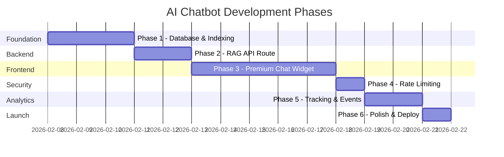
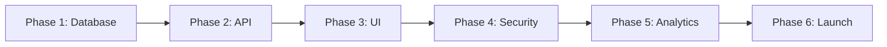

# AI RAG Chatbot — Development Phases
## Alpha Funding Phased Delivery Plan

> **Reference**: [Implementation Plan](./AI_CHATBOT_IMPLEMENTATION_PLAN.md)

---

## Overview

The AI RAG Chatbot is delivered in 6 phases over approximately 14 development days. Each phase has a clear deliverable and can be demonstrated independently.



---

## Phase 1: Foundation & Database
**Duration**: 3 Days | **Days 1-3**

### Description
Set up the database infrastructure including Neon PostgreSQL with pgvector, Drizzle ORM schemas, and the content indexing pipeline.

### Deliverables
| Deliverable | Success Criteria |
|-------------|------------------|
| Neon database provisioned | Database URL in `.env.local` |
| pgvector extension enabled | `SELECT * FROM pg_extension WHERE extname = 'vector';` returns row |
| Drizzle schemas created | Migrations run without errors |
| Content indexed | `SELECT COUNT(*) FROM embeddings;` returns > 0 |

### Key Files
- `lib/db/index.ts`
- `lib/db/schema/resources.ts`
- `lib/db/schema/embeddings.ts`
- `scripts/index-website.ts`
- `drizzle.config.ts`

### End-of-Phase Demo
Run `npx drizzle-kit studio` and show the populated `embeddings` table with vector data.

---

## Phase 2: RAG API Route
**Duration**: 2 Days | **Days 4-5**

### Description
Create the streaming API endpoint with tool-based retrieval and FCA-compliant system prompt.

### Deliverables
| Deliverable | Success Criteria |
|-------------|------------------|
| API route functional | `curl` command returns streaming response |
| Vector search working | Relevant chunks returned for test queries |
| System prompt compliant | Disclaimers included in responses |

### Key Files
- `app/api/chat/route.ts`
- `lib/ai/embedding.ts`
- `lib/ai/models.ts`

### End-of-Phase Demo
```bash
curl -X POST http://localhost:3000/api/chat \
  -H "Content-Type: application/json" \
  -d '{"messages":[{"role":"user","content":"What is invoice finance?"}]}'
```
Verify response streams and includes appropriate disclaimers.

---

## Phase 3: Premium Chat Widget
**Duration**: 5 Days | **Days 6-10**

### Description
Build the floating chat widget matching Alpha Funding's premium design system with Generative UI animations.

### Deliverables
| Deliverable | Success Criteria |
|-------------|------------------|
| Widget toggle works | Click opens/closes chat panel |
| Messages display | User and assistant messages styled correctly |
| Streaming animation | Text reveals word-by-word |
| Thinking indicator | Pulsing animation during loading |
| Suggested questions | Clickable chips trigger messages |
| Mobile responsive | Works on iOS Safari + Android Chrome |
| Accessible | Focus trap, escape key, aria labels |

### Key Files
- `components/chat/chat-widget.tsx`
- `components/chat/chat-panel.tsx`
- `components/chat/chat-messages.tsx`
- `components/chat/message-bubble.tsx`
- `components/chat/chat-input.tsx`
- `components/chat/thinking-indicator.tsx`
- `components/chat/suggested-questions.tsx`
- `components/chat/product-card.tsx`
- `components/chat/chat-disclaimer.tsx`
- `hooks/use-chat-widget.ts`

### End-of-Phase Demo
Open the website, click the chat bubble, ask "What funding options do I have?", observe streaming response with animations.

---

## Phase 4: Security & Rate Limiting
**Duration**: 1 Day | **Day 11**

### Description
Add production security measures including rate limiting and input sanitization.

### Deliverables
| Deliverable | Success Criteria |
|-------------|------------------|
| Rate limiting active | 50+ rapid requests return limit error |
| Injection detection | Malicious prompts handled safely |
| Privacy notice | Pre-chat notice visible |

### Key Files
- `middleware.ts`

### End-of-Phase Demo
Send 60 rapid messages through the widget; verify rate limit error appears after ~50.

---

## Phase 5: Analytics & Tracking
**Duration**: 2 Days | **Days 12-13**

### Description
Implement comprehensive analytics for chatbot interactions.

### Deliverables
| Deliverable | Success Criteria |
|-------------|------------------|
| PostHog events firing | Events visible in PostHog dashboard |
| Clarity recording | Session playback available |
| Custom events tracked | `chatbot_opened`, `message_sent` logged |

### Key Files
- Modified `components/chat/chat-widget.tsx` (event tracking)

### End-of-Phase Demo
Open PostHog dashboard, show `chatbot_opened` and `message_sent` events appearing after test interactions.

---

## Phase 6: Polish & Launch
**Duration**: 1 Day | **Day 14**

### Description
Final testing, accessibility audit, and production deployment.

### Deliverables
| Deliverable | Success Criteria |
|-------------|------------------|
| Cross-browser tested | Works on Chrome, Firefox, Safari, Edge |
| Mobile tested | Works on iOS Safari, Android Chrome |
| Accessibility passed | VoiceOver/TalkBack functional |
| Production deployed | Live on alphafunding.co.uk |

### End-of-Phase Demo
Show live chatbot on production URL, demonstrate a full conversation flow.

---

## Risk Checkpoints

### After Phase 1
- ✓ Database connection stable?
- ✓ Embeddings generating correctly?
- ✓ Vector search returning relevant results?

### After Phase 2
- ✓ API response time < 3 seconds?
- ✓ Streaming working properly?
- ✓ Disclaimers appearing in responses?

### After Phase 3
- ✓ Design matches Alpha Funding brand?
- ✓ Animations smooth on mobile?
- ✓ Accessibility features functional?

### After Phase 4
- ✓ Rate limiting blocking abuse?
- ✓ Injection attempts handled safely?

### After Phase 5
- ✓ Analytics events firing correctly?
- ✓ Session recordings capturing?

---

## Compliance Checkpoint (Mandatory)

> [!CAUTION]
> **Before Phase 6 Launch, verify ALL of the following:**

- [ ] System prompt states "Alpha Funding is NOT FCA Authorized"
- [ ] System prompt states "broker, not a lender"
- [ ] Responses include disclaimers naturally
- [ ] Chatbot refuses to guarantee approval
- [ ] Chatbot refuses to provide specific rates
- [ ] Chatbot refuses to give personalised financial advice
- [ ] Footer disclaimer visible at all times
- [ ] Privacy notice displayed before first message

---

## Dependencies per Phase



**Critical Path**: Phases are sequential. Database must exist before API, API must exist before UI, etc.

**Parallel Opportunities**: 
- Within Phase 3, UI components can be developed in parallel
- Within Phase 5, different analytics tools can be integrated simultaneously
